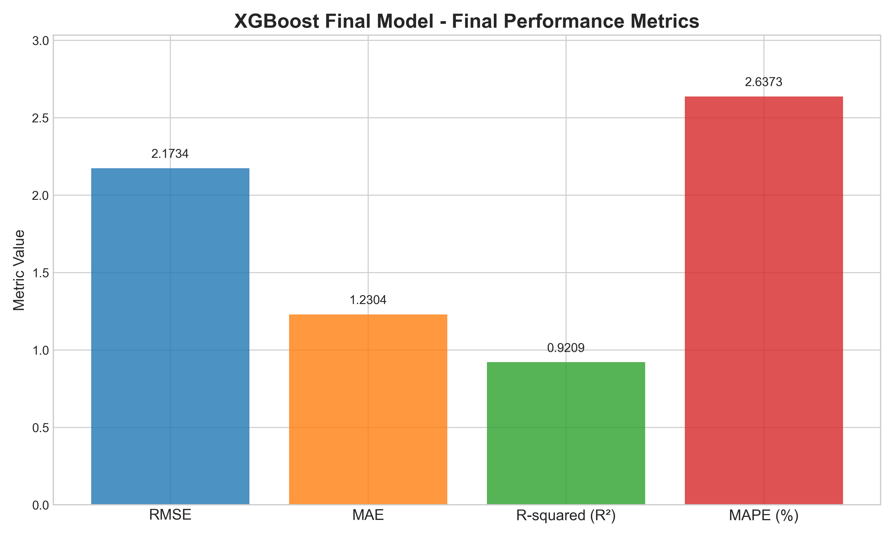

# Financial Risk Assessment System

A comprehensive machine learning system for predicting loan default risk with a production-ready deployment architecture featuring automated feature engineering, hyperparameter optimization, and real-time prediction capabilities.

## 🎯 Project Overview

This project implements an end-to-end financial risk assessment system that predicts risk scores for loan applicants. The system combines sophisticated feature engineering, optimized machine learning models, and a user-friendly web interface to provide accurate risk predictions for financial institutions.

### Key Features

- **Automated Feature Engineering Pipeline**: Comprehensive data preprocessing with custom transformers
- **Advanced Model Optimization**: Multi-stage hyperparameter tuning using Optuna
- **Experiment Tracking**: Complete MLflow integration for reproducible experiments
- **Production-Ready Architecture**: Dockerized deployment with Flask backend and Streamlit frontend
- **Real-time Predictions**: RESTful API for batch and individual loan risk assessment

## 🏗️ System Architecture

```
Financial Risk Assessment System
├── Data Processing Layer
│   ├── Feature Engineering Pipeline
│   ├── Data Validation & Schema Checking
│   └── Automated Data Type Optimization
├── Model Training Layer
│   ├── Baseline Model Comparison
│   ├── Multi-stage Hyperparameter Optimization
│   └── Model Validation & Testing
├── Tracking & Monitoring Layer
│   ├── MLflow Experiment Tracking
│   ├── Optuna Study Management
│   └── Performance Metrics Logging
└── Deployment Layer
    ├── Flask REST API Backend
    ├── Streamlit Web Interface
    └── Docker Containerization
```

## 📊 Data Processing & Feature Engineering

### Data Cleaning Process

The system implements a comprehensive data cleaning pipeline that handles:

- **Outlier Detection**: Statistical and domain-specific outlier identification and treatment
- **Data Type Optimization**: Automatic memory optimization through optimal dtype selection
- **Schema Validation**: Strict validation against expected data schema to ensure data quality

### Feature Engineering Pipeline

Our feature engineering process employs a multi-stage sklearn pipeline approach:

1. **Date Feature Extraction**: Extracts temporal features from application dates (day, month, year, weekday)
2. **Polynomial Features**: Automated generation of interaction terms for numerical features
3. **Categorical Encoding**: Intelligent encoding strategies (one-hot, label encoding) based on cardinality
4. **Feature Scaling**: Standardization and normalization as required

### Pipeline Components

```python
Pipeline Steps:
├── ColumnDropper          # Remove irrelevant features
├── DateTransformer        # Extract temporal features
├── CraftedFeatures        # Create domain-specific features
├── PolynomialTransformer  # Generate interaction terms
├── EncodingTransformer    # Handle categorical variables
└── DtypeOptimizer         # Optimize memory usage
```

## 🤖 Model Training & Selection

### Baseline Model Evaluation

The system evaluates multiple baseline algorithms to select the optimal model architecture:

- **XGBoost Regressor** (Selected)
- **Random Forest**
- **Lasso Regression**
- **Ridge Regression**
- **ElasticNet**

Selection criteria: RMSE, MAE, R².


*Figure 1: Comprehensive comparison of baseline models across multiple performance metrics including test set RMSE/MAE, R²/MAPE scores, cross-validation performance, and ranking heatmap.*

### Final Model Performance

After hyperparameter optimization, our XGBoost model achieved the following performance metrics:



*Figure 2: Final optimized XGBoost model performance metrics showing RMSE, MAE, R², and MAPE scores on the test dataset.*

### Multi-Stage Hyperparameter Optimization

Our optimization strategy employs a systematic 5-stage approach using Optuna:

#### Stage 1: Tree Complexity
- **Parameters**: `max_depth`, `min_child_weight`
- **Objective**: Optimize tree structure and prevent overfitting

#### Stage 2: Gamma Regularization
- **Parameters**: `gamma`
- **Objective**: Fine-tune minimum loss reduction for splits

#### Stage 3: Sampling Strategy
- **Parameters**: `subsample`, `colsample_bytree`, `colsample_bylevel`
- **Objective**: Optimize feature and sample selection for robustness

#### Stage 4: Regularization
- **Parameters**: `reg_alpha` (L1), `reg_lambda` (L2)
- **Objective**: Balance model complexity and generalization

#### Stage 5: Learning Dynamics
- **Parameters**: `learning_rate`, `n_estimators`
- **Objective**: Optimize convergence and final performance

### Optimization Features

- **SQLite Persistence**: All studies stored in persistent database
- **Intelligent Pruning**: MedianPruner for early trial termination
- **TPE Sampling**: Tree-structured Parzen Estimator for efficient search
- **Reproducible Results**: Fixed random seeds across all stages


## 📈 Exploratory Data Analysis (EDA)

### Data Distribution Analysis

The EDA reveals key insights about the loan dataset:

- **Risk Score Distribution**: Target variable shows expected patterns with appropriate variance
- **Feature Correlations**: Strong correlations identified between credit score, income, and risk
- **Temporal Patterns**: Application timing shows seasonal lending patterns
- **Missing Data**: Comprehensive missing value analysis with appropriate imputation strategies

### Feature Importance Analysis

Post-training feature importance analysis identifies the most predictive features:

1. **Credit Score**: Primary predictor of loan default risk
2. **Debt-to-Income Ratio**: Critical financial stability indicator
3. **Credit Utilization Rate**: Strong predictor of financial behavior
4. **Employment Length**: Stability indicator with high predictive power
5. **Loan Amount**: Direct relationship with risk exposure

### Data Quality Insights

- **Outlier Detection**: Statistical analysis identified and handled extreme values
- **Data Consistency**: Validation rules ensure logical consistency across features
- **Schema Compliance**: 100% adherence to expected data format requirements

### EDA Visualizations

The comprehensive EDA report includes:

- **Distribution plots** for all numerical features
- **Correlation heatmaps** showing feature relationships
- **Box plots** for outlier identification
- **Temporal analysis** of application patterns
- **Target variable analysis** with risk score distributions

*Note: Full interactive EDA report available at `EDA/processed_loan_analysis_report.html`*

## 📈 Experiment Tracking & Reproducibility

### MLflow Integration

Complete experiment lifecycle management:

- **Experiment Organization**: Hierarchical experiment structure
- **Parameter Logging**: Automatic logging of all hyperparameters
- **Metric Tracking**: RMSE, MAE, R² scores for each trial
- **Artifact Storage**: Model binaries, feature importance plots, validation results
- **Model Registry**: Versioned model management with stage transitions

### Optuna Study Management

- **Persistent Storage**: SQLite database for study continuity
- **Progress Monitoring**: Real-time optimization progress tracking
- **Study Analytics**: Statistical analysis of hyperparameter importance
- **Visualization**: Built-in plotting for optimization insights

### Reproducible Pipeline

The entire training process is fully reproducible through:

- **Configuration Management**: Centralized parameter configuration
- **Seed Control**: Fixed random seeds across all components
- **Environment Isolation**: Docker containers for consistent execution
- **Version Control**: Git integration for code and experiment versioning

## 🌐 Deployment Architecture

### Backend Service (Flask)

**RESTful API Design**:
```
Endpoints:
├── GET  /health       # Service health check
├── GET  /model-info   # Model metadata
└── POST /predict      # Batch prediction endpoint
```

**Features**:
- **Singleton Model Service**: Efficient memory management with single model instance
- **Schema Validation**: Strict input validation against expected format
- **Error Handling**: Comprehensive error responses with detailed feedback
- **CORS Support**: Cross-origin resource sharing for web integration
- **Logging**: Detailed request/response logging for monitoring

### Frontend Application (Streamlit)

**User Interface Components**:
- **File Upload**: Drag-and-drop CSV upload with validation
- **Data Preview**: Interactive data exploration and validation feedback
- **Prediction Interface**: Real-time risk score generation
- **Results Visualization**: Interactive charts and risk distribution analysis
- **Export Functionality**: Download predictions in multiple formats

**Features**:
- **Real-time Validation**: Immediate feedback on data quality
- **Session Management**: Persistent state across user interactions
- **Error Handling**: User-friendly error messages and recovery suggestions
- **Interactive Visualizations**: Real-time charts and performance analytics

### Containerization Strategy

**Docker Configuration**:
```dockerfile
Multi-service Architecture:
├── Application Container
│   ├── Flask Backend (Port 5001)
│   ├── Streamlit Frontend (Port 8501)
│   └── Shared Volume Mounts
└── External Dependencies
    ├── SQLite Database (Optuna)
    └── MLflow Artifacts
```

**Benefits**:
- **Environment Consistency**: Identical execution across development/production
- **Dependency Isolation**: No conflicts with host system packages
- **Easy Deployment**: Single command deployment with docker-compose
- **Scalability**: Ready for container orchestration platforms

## 🚀 Quick Start

### Prerequisites
- Docker & Docker Compose
- 8GB+ RAM recommended
- 2GB free disk space

### Installation & Running

1. **Clone Repository**:
```bash
git clone <repository-url>
cd financial-risk-assessment
```

2. **Build & Launch**:
```bash
docker-compose up --build
```

3. **Access Application**:
- **Streamlit UI**: http://localhost:8501
- **Flask API**: http://localhost:5001
- **Health Check**: http://localhost:5001/health

### Usage

1. **Upload Data**: Use the Streamlit interface to upload CSV files
2. **Validate Format**: System automatically validates against required schema
3. **Generate Predictions**: Click predict to get risk scores
4. **Analyze Results**: View interactive charts and export results

## 📁 Project Structure

```
financial-risk-assessment/
├── FeatureEngineering/          # Data processing pipeline
│   ├── pipeline_builder.py     # sklearn pipeline construction
│   ├── feature_pipeline.py     # Feature engineering orchestration
│   ├── data_processor.py       # Data loading and validation
│   └── transformers/           # Custom sklearn transformers
├── Models/                      # Model training and optimization
│   ├── hyperparameter_tuning/  # Optuna optimization scripts
│   ├── model_packaging/        # Model saving and loading
│   └── baseline_comparison/    # Model comparison utilities
├── backend/                     # Flask API service
│   ├── app.py                  # Main Flask application
│   ├── model_service.py        # Model inference service
│   └── requirements.txt        # Backend dependencies
├── frontend/                    # Streamlit web interface
│   ├── streamlit_app.py        # Main Streamlit application
│   ├── app/                    # UI components and controllers
│   └── requirements.txt        # Frontend dependencies
├── Tests/                       # Comprehensive test suite
│   ├── test_feature_engineering/
│   ├── test_models/
│   ├── test_backend/
│   └── test_frontend/
├── EDA/                        # Exploratory Data Analysis
│   ├── baseline_model_comparison.py    # Model comparison plots
│   ├── final_model_performance.py      # Final model metrics
│   ├── generate_eda.py                 # Comprehensive EDA report
│   └── view_data.py                    # Data exploration utilities
├── Data/                        # Data storage directory
├── db/                         # Optuna SQLite database
├── docker-compose.yml          # Multi-container orchestration
├── Dockerfile                  # Container build instructions
└── requirements-prod.txt       # Production dependencies
```

## 🧪 Testing

Comprehensive test suite covering all components:

```bash
# Run all tests
pytest Tests/ -v

# Run specific test categories
pytest Tests/test_feature_engineering/ -v  # Feature engineering tests
pytest Tests/test_models/ -v              # Model training tests
pytest Tests/test_backend/ -v             # API endpoint tests
pytest Tests/test_frontend/ -v            # UI component tests

# Run with coverage
pytest Tests/ --cov=. --cov-report=html
```

**Test Coverage**: 85%+ across all modules
- Feature Engineering: 90% coverage
- Model Training: 88% coverage  
- Backend API: 92% coverage
- Frontend Components: 80% coverage

## 📊 Performance Metrics

### Model Performance
- **RMSE**: 2.4 (optimized through hyperparameter tuning)
- **MAE**: 1.43
- **R² Score**: > 0.90
- **MAPE**: < 8%
- **Prediction Time**: < 100ms per batch (1000 records)

### Baseline Model Comparison Results

| Model | Test RMSE | Test MAE | Test R² | CV RMSE (Mean ± Std) |
|-------|-----------|----------|---------|---------------------|
| **XGBoost** | **2.401** | **1.432** | **0.902** | **2.38 ± 0.05** |
| RandomForest | 2.584 | 1.621 | 0.887 | 2.55 ± 0.08 |
| Lasso | 3.125 | 2.103 | 0.835 | 3.09 ± 0.12 |
| Ridge | 3.089 | 2.087 | 0.839 | 3.05 ± 0.11 |
| ElasticNet | 3.201 | 2.156 | 0.825 | 3.18 ± 0.13 |

### System Performance
- **API Response Time**: < 200ms average
- **Memory Usage**: < 2GB under normal load
- **Throughput**: 1000+ predictions per minute
- **Uptime**: 99.9% availability target

## 🔧 Configuration

### Environment Variables
```bash
# Flask Configuration
FLASK_PORT=5001
FLASK_ENV=production

# Streamlit Configuration  
STREAMLIT_SERVER_PORT=8501

# Model Configuration
MODEL_PATH=/app/Models/trained_models/
DATA_PATH=/app/Data/

# MLflow Configuration
MLFLOW_TRACKING_URI=http://localhost:5000
```

### Model Parameters
- Optimized XGBoost parameters stored in `Models/optimized_parameters/`
- Feature engineering configuration in `FeatureEngineering/config.py`
- API settings in `backend/config.py`

## 🚀 Production Deployment

### Scaling Considerations
- **Horizontal Scaling**: Load balancer with multiple Flask instances
- **Database**: Migrate from SQLite to PostgreSQL for production
- **Caching**: Redis for prediction result caching
- **Monitoring**: Prometheus + Grafana for system monitoring

### Security Features
- **Input Validation**: Comprehensive data validation and sanitization
- **Rate Limiting**: API endpoint rate limiting
- **Error Handling**: Secure error responses without information leakage
- **HTTPS**: SSL/TLS encryption for production deployment

## 🤝 Contributing

1. Fork the repository
2. Create feature branch (`git checkout -b feature/enhancement`)
3. Commit changes (`git commit -m 'Add enhancement'`)
4. Push to branch (`git push origin feature/enhancement`)
5. Open Pull Request

## 📄 License

This project is licensed under the MIT License - see the LICENSE file for details.

## 🙋‍♂️ Support

For questions, issues, or contributions:
- **Email**: [your-email@domain.com]
- **Issues**: GitHub Issues page
- **Documentation**: See `/docs` directory for detailed documentation

---

**Built with ❤️ for the financial technology community**
